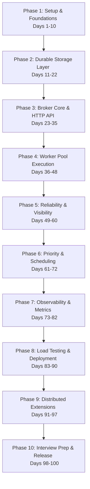

# Rustiq: 100-Day Production-Grade Build Plan

A comprehensive, day-by-day roadmap to design, implement, scale, and master a distributed task queue in Rust. This plan builds system design depth, coding fluency, and production-level software engineering skills to prepare for SDE interviews at Google, Meta, Amazon, and Microsoft.

---

## 🗺 Roadmap Overview



---

## Phase 1: Project Foundations & Core Types (Days 1–10)
**Goal:** Build a solid understanding of system design concepts, initialize the project structure, define core data structures, and establish structured logging.

### Day 1: System Design Research & Architecture Mapping [COMPLETED]
*   **Focus:** Understand the distributed task queue model.
*   **Action Items:** Read the Rustiq blueprint doc. Draw a high-level block diagram outlining the boundaries of:
    1.  **Producer Client:** HTTP or TCP clients submitting jobs.
    2.  **Broker / Server:** Core coordinator managing queues.
    3.  **Storage Layer:** Persistence backend (Sled / Redis).
    4.  **Worker Pool:** Executing nodes processing handlers.
*   **System Design Context:** Contrast push-based systems (RabbitMQ/Webhook) with pull-based systems (SQS/Celery/BullMQ). Notice how pull-based systems naturally implement backpressure.
*   **Verification:** Save a text-based architecture description or ASCII diagram into `docs/architecture.md`.

### Day 2: Advanced Async Rust Review [COMPLETED]
*   **Focus:** Concurrency model of Rust.
*   **Action Items:** Read Chapters 16 & 17 of *The Rust Programming Language* (concurrency and traits). Study Tokio's async runtime model (Green threads, work-stealing scheduler, blocking tasks vs async tasks).
*   **System Design Context:** Interviewers love asking how Rust's multi-threaded work-stealing runtime compares to Node.js's single-threaded event loop or Go's goroutines.
*   **Verification:** Write a short markdown file summarizing the memory safety advantages of `Send` and `Sync` boundaries in async contexts.

### Day 3: Project Scaffold & Dependency Management [COMPLETED]
*   **Focus:** Workspace organization.
*   **Action Items:** Initialize the cargo repository (`cargo init --bin rustiq`). Open and configure `Cargo.toml` with the following dependencies:
    ```toml
    [dependencies]
    tokio = { version = "1.35", features = ["full"] }
    axum = "0.7"
    serde = { version = "1.0", features = ["derive"] }
    serde_json = "1.0"
    uuid = { version = "1.6", features = ["v4", "serde"] }
    chrono = { version = "0.4", features = ["serde"] }
    sled = "0.34"
    tracing = "0.1"
    tracing-subscriber = { version = "0.3", features = ["env-filter", "json"] }
    async-trait = "0.1"
    thiserror = "1.0"
    ```
*   **System Design Context:** Using modular, modern crates helps keep the codebase stable and reflects professional dependency management.
*   **Verification:** Run `cargo check` and ensure it compiles successfully with zero warnings.

### Day 4: Core Domain Types (`types.rs`) [COMPLETED]
*   **Focus:** Structuring the core domain model.
*   **Action Items:** Create `src/types.rs`. Define `JobStatus` enum (`Queued`, `Processing`, `Done`, `Failed`, `DeadLetter`). Define the main `Job` struct:
    ```rust
    pub struct Job {
        pub id: uuid::Uuid,
        pub queue: String,
        pub payload: serde_json::Value,
        pub status: JobStatus,
        pub priority: u8,
        pub retry_count: u32,
        pub max_retries: u32,
        pub created_at: chrono::DateTime<chrono::Utc>,
        pub scheduled_at: Option<chrono::DateTime<chrono::Utc>>,
        pub lease_expires_at: Option<chrono::DateTime<chrono::Utc>>,
        pub visibility_timeout_secs: u64,
        pub result: Option<serde_json::Value>,
        pub error: Option<String>,
    }
    ```
*   **System Design Context:** The structure of a `Job` represents the schema contracts that flow between distributed nodes. Keep it clean and serialized.
*   **Verification:** Write unit tests inside `types.rs` that verify serialization/deserialization to and from JSON.

### Day 5: Queue Configurations [COMPLETED]
*   **Focus:** Queue customization properties.
*   **Action Items:** Implement a `QueueConfig` struct in `src/types.rs`. It should define custom settings for individual queues, such as default visibility timeouts and maximum retries.
*   **System Design Context:** Multi-tenant systems require queues to configure separate parameters depending on execution constraints (e.g. fast vs slow tasks).
*   **Verification:** Write unit tests checking config default fallback values when a queue does not explicitly define overrides.

### Day 6: Error Handling Architecture (`errors.rs`) [COMPLETED]
*   **Focus:** Robust error handling.
*   **Action Items:** Create `src/errors.rs`. Define a central `RustiqError` enum using `thiserror`. Define enum variants: `StorageError(String)`, `QueueNotFound(String)`, `SerializationError`, `InvalidPayload(String)`.
*   **System Design Context:** Production software must handle failures gracefully. Distinguishing between recoverable storage errors and unrecoverable payload validation errors is essential.
*   **Verification:** Write tests converting raw storage or JSON errors into `RustiqError` using the `?` operator.

### Day 7: Storage Trait Abstraction (`storage/mod.rs`) [COMPLETED]
*   **Focus:** Decoupling DB adapters from system logic.
*   **Action Items:** Create directory `src/storage/`. Write `src/storage/mod.rs`. Define the async `Storage` trait using `#[async_trait]`:
    ```rust
    #[async_trait]
    pub trait Storage: Send + Sync {
        async fn save_job(&self, job: &Job) -> Result<(), RustiqError>;
        async fn get_job(&self, id: uuid::Uuid) -> Result<Option<Job>, RustiqError>;
        async fn delete_job(&self, id: uuid::Uuid) -> Result<(), RustiqError>;
        async fn update_job_status(&self, id: uuid::Uuid, status: JobStatus) -> Result<(), RustiqError>;
    }
    ```
*   **System Design Context:** Interfaces (traits in Rust) allow switching the persistence layer (e.g., Sled to Redis or Postgres) without rewriting the core queue coordinator.
*   **Verification:** Compile the codebase with the `Storage` trait definition.

### Day 8: In-Memory Storage Mock [COMPLETED]
*   **Focus:** Testing without disk dependencies.
*   **Action Items:** Implement `MockStorage` in `src/storage/mod.rs` using a `HashMap<Uuid, Job>` wrapped inside a thread-safe lock `std::sync::Arc<tokio::sync::RwLock>`.
*   **System Design Context:** Using mock abstractions speeds up testing cycles and enables isolating networking/disk concerns.
*   **Verification:** Write unit tests to insert, retrieve, and delete a job via the mock storage.

### Day 9: Logging Infrastructure Setup [COMPLETED]
*   **Focus:** System observability setup.
*   **Action Items:** Configure structured logging in `src/main.rs` using `tracing_subscriber` with JSON output formatting. Support setting log filters using environment variables (e.g. `RUST_LOG=info`).
*   **System Design Context:** Structured logging (JSON format) allows external tools like ElasticSearch, Splunk, or Loki to parse logs for system failures.
*   **Verification:** Run the application and observe formatted JSON logs output to stdout.

### Day 10: Phase 1 Code Review & Cleanup [COMPLETED]
*   **Focus:** Quality assurance.
*   **Action Items:** Run `cargo fmt` to auto-format files. Run `cargo clippy --all-targets` and resolve warnings. Check imports across modules.
*   **Verification:** Confirm all unit tests pass and compile clean.

---

## Phase 2: Persistent Storage Layer (Days 11–22)
**Goal:** Implement a durable storage backend using `Sled` (a pure-Rust, embedded transactional database) with proper state guarantees.

### Day 11: Sled Mechanics & API Study [COMPLETED]
*   **Focus:** Understanding embedded transactional storage.
*   **Action Items:** Study `sled` docs. Understand its B-tree structure, key spaces, multi-version concurrency control (MVCC), and batch write operations.
*   **System Design Context:** Why use an embedded database like Sled instead of PostgreSQL? No network hop, lower latency, simple deployment, and ACID transaction support.
*   **Verification:** Document Sled's recovery mechanisms and memory-mapped file characteristics.

### Day 12: Storage Backend Setup (`storage/sled.rs`) [COMPLETED]
*   **Focus:** Sled connector initialization.
*   **Action Items:** Create `src/storage/sled.rs`. Implement a `SledStorage` struct containing a `sled::Db` handle. Add constructor `pub fn new(path: &str) -> Result<Self, RustiqError>`.
*   **System Design Context:** Database initialization should handle clean recoveries if the database files were not cleanly closed on shutdown.
*   **Verification:** Instantiate `SledStorage` inside a test and verify a database file directory is generated.

### Day 13: Sled Storage Impl: Write & Retrieve
*   **Focus:** Persisting Jobs.
*   **Action Items:** Implement `save_job` and `get_job` for `SledStorage`. Convert the `Job` struct to serialized JSON bytes, storing them in Sled with a key format of `job:<uuid>`.
*   **System Design Context:** Standardizing key patterns is critical when reading raw byte slots in key-value stores.
*   **Verification:** Save a job, close the DB connection, re-open it, and assert the read job matches the written job.

### Day 14: Sled Storage Impl: Status Transitions & Deletes
*   **Focus:** State updates.
*   **Action Items:** Implement `delete_job` and `update_job_status` in `SledStorage`. Ensure status updates read the existing job, modify the status field, and write it back inside Sled.
*   **System Design Context:** Modifying data in key-value stores requires handling concurrency collisions if two threads modify the same key.
*   **Verification:** Test status updates from `Queued` to `Processing` and verify the status is persisted.

### Day 15: Sled Storage Impl: Queue Prefix Scans
*   **Focus:** Retrieving jobs by queue category.
*   **Action Items:** Add a method to scan Sled for jobs belonging to a specific queue. Use `db.scan_prefix` with key format `job:` and filter records by queue name.
*   **System Design Context:** Prefix scans can be slow on large datasets. Optimize by indexing or keeping dataset sizes manageable.
*   **Verification:** Write a test inserting jobs across multiple queues and assert that prefix scan returns only the correct records.

### Day 16: Thread-Safe DB Handles
*   **Focus:** Multithreaded database safety.
*   **Action Items:** Wrap the inner database handle in `Arc` if necessary, and ensure `SledStorage` derives `Clone` safely.
*   **System Design Context:** Axum route handlers run on a pool of threads. The storage struct must be safe to share across threads.
*   **Verification:** Compile database operations inside parallel Tokio threads.

### Day 17: Storage Transaction Safeties
*   **Focus:** Atomic multi-writes.
*   **Action Items:** Implement atomic Sled transactions (`db.transaction()`) when writing a job and updating an index mapping (e.g. `queue:name:job_id`).
*   **System Design Context:** If the broker crashes while enqueuing, the job must either be fully saved with its index, or not saved at all (Atomicity).
*   **Verification:** Write a test simulating a crash midway through execution to verify rollbacks.

### Day 18: Storage Failure Parsing
*   **Focus:** Translating low-level Sled errors.
*   **Action Items:** Implement the `From<sled::Error>` trait for `RustiqError` to convert database errors cleanly.
*   **System Design Context:** Don't leak raw database stack traces to the API client.
*   **Verification:** Verify Sled write failures return a parsed `StorageError`.

### Day 19: Storage Mock vs. Live Sled Integration Tests
*   **Focus:** Interface consistency.
*   **Action Items:** Create `tests/storage_tests.rs`. Write reusable test suites that execute identical operations against both `MockStorage` and `SledStorage`.
*   **System Design Context:** Code sharing in tests guarantees that storage behavior remains consistent across different implementations.
*   **Verification:** Execute `cargo test --test storage_tests` and ensure all assertions pass.

### Day 20: Database Directory Lifecycles
*   **Focus:** Clean test runs.
*   **Action Items:** Configure Sled tests to write to temporary directories that are deleted when the tests finish.
*   **System Design Context:** Avoid cluttering disks with temporary test databases.
*   **Verification:** Verify no database test folders remain in your project root after running tests.

### Day 21: Database Corruptions & Recovery
*   **Focus:** Data integrity.
*   **Action Items:** Implement checks during database initialization. If database files are corrupted or fail to deserialize, log a warning and initialize a clean database.
*   **System Design Context:** Production systems must recover gracefully from corrupted storage files.
*   **Verification:** Manually overwrite a DB file with random bytes, run the tests, and verify it recovers.

### Day 22: Phase 2 Code Review & Clippy
*   **Focus:** Storage optimization.
*   **Action Items:** Review Sled storage code. Run `cargo clippy --all-targets` and resolve warnings.
*   **Verification:** Verify Sled storage throughput meets basic operational requirements.

---

## Phase 3: Broker Core & HTTP API Setup (Days 23–35)
**Goal:** Implement the Axum HTTP router, state sharing, request validation, and core queue management API.

### Day 23: Axum Framework Routing & State
*   **Focus:** API layout design.
*   **Action Items:** Create `src/api/mod.rs` and `src/api/handlers.rs`. Set up the Axum router with health endpoints.
*   **System Design Context:** Separating route routing from handler implementations keeps large API codebases clean and maintainable.
*   **Verification:** Confirm compilation of the empty handler functions.

### Day 24: Axum Web Server Setup
*   **Focus:** HTTP listening socket.
*   **Action Items:** Write the server bootstrap in `src/main.rs`. Listen on address `0.0.0.0:3000` using Tokio's tcp listener.
*   **System Design Context:** Binding to `0.0.0.0` allows Docker containers to route external traffic to your application.
*   **Verification:** Start the server and ping `/health` using `curl`.

### Day 25: AppState Injection
*   **Focus:** Dependency Injection.
*   **Action Items:** Create `AppState` containing storage reference `Arc<dyn Storage>`. Register `AppState` using Axum's `State` extractor.
*   **System Design Context:** Thread-safe state sharing avoids using global variables, which can lead to race conditions.
*   **Verification:** Verify state is accessible from route handlers.

### Day 26: Request Validation
*   **Focus:** API request validation.
*   **Action Items:** Define `EnqueueRequest` struct in `handlers.rs`. Validate that queue name is not empty and payload is valid JSON.
*   **System Design Context:** Input validation is key to security and stability.
*   **Verification:** Verify enqueuing an invalid request payload returns a `400 Bad Request` status.

### Day 27: Enqueue Endpoint (`POST /enqueue`)
*   **Focus:** Enqueue execution.
*   **Action Items:** Implement the `/enqueue` handler. Save the job with status `Queued` and return a `202 Accepted` status with the job ID.
*   **System Design Context:** Why return 202 instead of 200/201? 202 indicates the task was accepted for processing, but execution has not finished.
*   **Verification:** Enqueue a task using `curl` and verify it returns a UUID:
    ```bash
    curl -X POST http://localhost:3000/enqueue -d '{"queue":"default", "payload":{"data":"hello"}}' -H "Content-Type: application/json"
    ```

### Day 28: Status Endpoint (`GET /status/:job_id`)
*   **Focus:** Querying job status.
*   **Action Items:** Implement the `/status/:job_id` handler. Look up the job ID in storage and return its execution details.
*   **System Design Context:** Task queues should expose status APIs to allow clients to track asynchronous workflows.
*   **Verification:** Query the status of an enqueued job ID and verify the JSON output.

### Day 29: Queue Metadata Endpoint (`GET /queues`)
*   **Focus:** Monitoring queue metrics.
*   **Action Items:** Implement `/queues` handler. Return details like queue name and total job counts.
*   **System Design Context:** Metadata endpoints are used by monitoring tools and control panels to track queue health.
*   **Verification:** Verify the JSON list displays the correct queue metrics.

### Day 30: Cancellation Endpoint (`DELETE /jobs/:job_id`)
*   **Focus:** Canceling pending tasks.
*   **Action Items:** Implement `/jobs/:job_id` to delete the job from storage.
*   **System Design Context:** Cancel APIs must handle scenarios where tasks are already executing or completed.
*   **Verification:** Enqueue a job, cancel it, and verify that status queries return a `404 Not Found` or `Cancelled` state.

### Day 31: HTTP Request Tracing Middleware
*   **Focus:** API tracing.
*   **Action Items:** Integrate tracing middleware in Axum using `tower_http::trace::TraceLayer`.
*   **System Design Context:** Middleware tracing captures request latency, request paths, and HTTP statuses automatically.
*   **Verification:** Verify API calls print structured logs containing path info and latencies.

### Day 32: Axum Route Integration Tests
*   **Focus:** Endpoint route tests.
*   **Action Items:** Create `tests/api_tests.rs`. Test Axum handlers directly using `tower::ServiceExt::oneshot`.
*   **System Design Context:** Router tests verify handlers, status codes, and routing without the overhead of network sockets.
*   **Verification:** Run `cargo test --test api_tests` and confirm all tests pass.

### Day 33: End-to-End HTTP socket tests
*   **Focus:** Verification over TCP.
*   **Action Items:** Write helper tests starting the Axum server on a dynamic port (`127.0.0.1:0`) and perform client HTTP requests using `reqwest`.
*   **System Design Context:** Socket tests verify that JSON parsing, network protocols, and socket connections work together.
*   **Verification:** Confirm integration test client returns successful API payloads.

### Day 34: JSON Error Responses
*   **Action Items:** Implement a custom error handler in Axum that formats internal errors as JSON:
    ```json
    { "error": "Reason for failure" }
    ```
*   **System Design Context:** API clients expect standardized, machine-readable JSON error formats.
*   **Verification:** Test invalid routes or lookup failures and verify the response is structured JSON.

### Day 35: Phase 3 Verification & Performance Check
*   **Focus:** API verification.
*   **Action Items:** Clean up routes, run clippy, and optimize response serialization.
*   **Verification:** Ensure compilation passes and latency is minimal.

---

## Phase 4: Async Worker Pool & Job Execution (Days 36–48)
**Goal:** Build the async worker pool structure that spawns concurrent workers, registers handlers, and executes jobs safely.

### Day 36: Tokio Task Spawning Design
*   **Focus:** Concurrent design planning.
*   **Action Items:** Design the worker pool architecture. Plan how workers communicate with the broker using channels.
*   **System Design Context:** Managing concurrency requires setting up structural patterns to run parallel operations safely.
*   **Verification:** Document the channel designs and task spawning flow.

### Day 37: The JobHandler Trait (`worker/mod.rs`)
*   **Focus:** Abstracting task execution.
*   **Action Items:** Create `src/worker/mod.rs`. Define `JobHandler` trait with async execute method.
*   **System Design Context:** Standardizing job execution interfaces allows writing reusable workers that can run arbitrary business logic.
*   **Verification:** Compile simple handlers implementing the `JobHandler` trait.

### Day 38: WorkerPool Struct Design
*   **Focus:** Worker pool layout.
*   **Action Items:** Implement the `WorkerPool` struct with fields for tracking active worker threads and queue maps.
*   **System Design Context:** Worker pools manage resources by setting limits on maximum execution concurrency.
*   **Verification:** Compile the struct definition successfully.

### Day 39: Job Handler Registry
*   **Focus:** Task routing mapping.
*   **Action Items:** Create a registry matching queue names to custom `JobHandler` implementations.
*   **System Design Context:** Storing handlers in a registry routes incoming jobs to their matching execution handler.
*   **Verification:** Write unit tests registering and retrieving custom handlers.

### Day 40: Worker Polling Loop
*   **Focus:** Task polling implementation.
*   **Action Items:** Implement the worker loop that polls the storage layer for pending jobs.
*   **System Design Context:** Polling loops must query resources without causing CPU spikes or lock contention.
*   **Verification:** Verify workers loop consistently when jobs are enqueued.

### Day 41: Async Job Executor (`worker/executor.rs`)
*   **Focus:** Executing individual tasks.
*   **Action Items:** Create `src/worker/executor.rs` to fetch jobs, look up handlers, and process them.
*   **System Design Context:** Isolating execution state prevents tasks from interfering with other running operations.
*   **Verification:** Verify that executing a job updates its storage state correctly.

### Day 42: Panic Isolation
*   **Focus:** Execution resilience.
*   **Action Items:** Wrap worker execution tasks using `std::panic::AssertUnwindSafe` and `FutureExt::catch_unwind`.
*   **System Design Context:** A worker pool must isolate panics. A bug in a single job handler must not crash the entire worker thread.
*   **Verification:** Verify a panicking task fails the job status without crashing the worker pool.

### Day 43: Sample Image Handler
*   **Focus:** Simulated image tasks.
*   **Action Items:** Implement an `ImageResizeHandler` simulating heavy CPU work with Tokio delays.
*   **System Design Context:** Creating dummy handlers helps verify worker pool behavior under simulated workloads.
*   **Verification:** Verify async execution output runs without blocking the runtime threads.

### Day 44: Concurrency Pool Verifications
*   **Focus:** Verifying concurrency limits.
*   **Action Items:** Write tests confirming that worker execution respects the configured concurrency limits.
*   **System Design Context:** Concurrency limits prevent the task queue from exhausting database or system resources.
*   **Verification:** Assert that when concurrency limit is 2, running 4 jobs executes them in two batches.

### Day 45: Graceful Worker Shutdown
*   **Focus:** Shutting down cleanly.
*   **Action Items:** Implement shutdown signaling using a broadcast channel.
*   **System Design Context:** Graceful shutdowns ensure in-flight tasks finish before the process exits.
*   **Verification:** Signal shutdown and verify active jobs finish while new tasks are refused.

### Day 46: Backpressure Integration
*   **Focus:** Polling rate control.
*   **Action Items:** Implement polling logic that pauses when all workers are currently busy.
*   **System Design Context:** Backpressure ensures the broker does not retrieve jobs from storage if no workers are available to process them.
*   **Verification:** Confirm polling stops when the worker pool reaches saturation.

### Day 47: Integration: HTTP + Worker Pool
*   **Focus:** End-to-end integration.
*   **Action Items:** Start the HTTP server and Worker Pool side-by-side in `main.rs`.
*   **System Design Context:** Integrating all modules connects the ingestion API directly to the background execution engine.
*   **Verification:** Enqueue a job via POST and verify the worker logs successful execution.

### Day 48: Phase 4 Review & Profiling
*   **Focus:** Profiling execution.
*   **Action Items:** Run clippy, format code, and check memory footprint.
*   **Verification:** Verify memory footprint is stable under sustained worker cycles.

---

## Phase 5: Reliability & Visibility Timeout (Days 49–60)
**Goal:** Implement the at-least-once delivery guarantee using SQS-like visibility timeouts, dead letter queues, and background reapers.

### Day 49: Exponential Backoff Theory
*   **Focus:** Retry spacing.
*   **Action Items:** Implement retry calculations where delay increases exponentially ($2^{\text{retry\_count}}$ seconds) with randomized jitter.
*   **System Design Context:** Backoff delay with jitter prevents "thundering herd" issues where multiple failed tasks retry at the same time and overload downstream databases.
*   **Verification:** Write unit tests asserting that retry delays increment correctly.

### Day 50: Atomic Lease Assignment
*   **Focus:** Thread-safe job polling.
*   **Action Items:** Implement transaction logic in storage that updates a job to `Processing` and sets `lease_expires_at` atomically.
*   **System Design Context:** Atomic updates prevent "double-delivery" where multiple workers pull the same job from the queue.
*   **Verification:** Verify that concurrent reads do not return duplicate leased jobs.

### Day 51: Job Acknowledgement (ACK)
*   **Focus:** Task completion.
*   **Action Items:** Implement the ACK API to mark a job as `Done` in storage.
*   **System Design Context:** Task queues must clean up or archive completed records to optimize disk usage.
*   **Verification:** Verify completed jobs are updated to `Done` status and deleted or archived.

### Day 52: Job NACK (Negative ACK)
*   **Focus:** Fast retry handling.
*   **Action Items:** Implement the NACK API to immediately release a failed task back to the queue.
*   **System Design Context:** A NACK handler releases tasks back to the queue immediately without waiting for lease timeouts.
*   **Verification:** Confirm that calling NACK transitions a job status back to `Queued` instantly.

### Day 53: Background Reaper Task
*   **Focus:** Periodic tasks.
*   **Action Items:** Implement a background thread running every 5 seconds.
*   **System Design Context:** Reapers clean up stale tasks that were abandoned by crashed workers.
*   **Verification:** Verify the reaper task logs checks periodically without blocking the main event loop.

### Day 54: Expired Lease Queries
*   **Focus:** Scanning database for stale leases.
*   **Action Items:** Implement search queries for jobs in the `Processing` state where `lease_expires_at` is older than the current time.
*   **System Design Context:** Fast queries are essential to avoid performance bottlenecks in background cleanup loops.
*   **Verification:** Store a mock job with an expired lease and verify the scanner detects it.

### Day 55: Requeuer Integration
*   **Focus:** Releasing expired jobs.
*   **Action Items:** Implement requeue logic in the reaper task, clearing leases and updating status to `Queued`.
*   **System Design Context:** Requeuing is key to guaranteeing at-least-once task delivery if worker nodes crash.
*   **Verification:** Verify expired tasks are returned to the queue and re-dispatched.

### Day 56: Dead Letter Queue (DLQ) Routing
*   **Focus:** Isolating failing tasks.
*   **Action Items:** Route tasks to `DeadLetter` status once their retry count exceeds the `max_retries` limit.
*   **System Design Context:** DLQs isolate failing tasks so they do not block the queue or consume CPU resources indefinitely.
*   **Verification:** Verify a failing job moves to the DLQ after reaching its retry limit.

### Day 57: Crash Simulations
*   **Focus:** System reliability testing.
*   **Action Items:** Write a test that enqueues a job, starts a worker, and terminates the worker task mid-execution.
*   **Verification:** Verify the reaper task detects the abandoned job and transitions it back to the queue.

### Day 58: Backoff Jitter Integration
*   **Focus:** Jitter logic.
*   **Action Items:** Add random noise (jitter) to the backoff duration calculation.
*   **System Design Context:** Jitter prevents scheduled tasks from synchronization loops that can overload systems.
*   **Verification:** Assert retry calculations return random jitter distribution values.

### Day 59: Scheduler Integration
*   **Focus:** Scheduling retries.
*   **Action Items:** Save retrying jobs with their next scheduled run times.
*   **System Design Context:** Retry timing should be managed by the scheduler to respect the computed backoff delay.
*   **Verification:** Verify retried tasks remain pending until their backoff delay expires.

### Day 60: Phase 5 Integration Verification
*   **Focus:** Verification.
*   **Action Items:** Run the test suite and check for deadlocks or race conditions between workers and the reaper task.
*   **Verification:** Verify that a pipeline execution completes successfully under synthetic worker failure scenarios.

---

## Phase 6: Priority Queueing & Scheduled Jobs (Days 61–72)
**Goal:** Implement heap-based priority sorting, delayed job scheduling, and recurring cron tasks.

### Day 61: Heap Priority Theory
*   **Focus:** Structuring priority queues.
*   **Action Items:** Study priority structures and Rust's `std::collections::BinaryHeap`.
*   **System Design Context:** Priority queues allow urgent tasks to bypass standard queues.
*   **Verification:** Design a `PriorityJob` struct implementing `Ord` to support min-heap priority sorting.

### Day 62: PriorityJob Struct Implementation
*   **Focus:** Priority sorting rules.
*   **Action Items:** Implement the `PriorityJob` wrapper, using `priority` (low value = high priority) and enqueued time for tiebreaking.
*   **System Design Context:** Tiebreaking ensures that jobs with the same priority are processed in a fair FIFO order.
*   **Verification:** Write tests verifying heap sorting order under various priority values.

### Day 63: Thread-Safe Priority Deque
*   **Focus:** Concurrent queue operations.
*   **Action Items:** Integrate `BinaryHeap` into the broker wrapped in thread-safe locks (`Mutex`/`RwLock`).
*   **System Design Context:** Mutex locks prevent concurrent modifications from corrupting the in-memory queue.
*   **Verification:** Write a test that concurrently enqueues high and low-priority jobs and asserts they are dequeued in the correct order.

### Day 64: Starvation Prevention (Aging)
*   **Focus:** Preventing queue starvation.
*   **Action Items:** Implement an aging algorithm that scans the priority heap periodically and boosts the priority of jobs that have been waiting.
*   **System Design Context:** Starvation occurs when low-priority jobs are blocked indefinitely by a steady stream of high-priority jobs.
*   **Verification:** Write a test verifying that low-priority jobs are eventually executed when higher-priority jobs are continually enqueued.

### Day 65: Scheduled Jobs Design
*   **Focus:** Storing delayed jobs.
*   **Action Items:** Design delayed job storage by indexing jobs in Sled with `scheduled_at` timestamps.
*   **System Design Context:** Delayed jobs must be indexed by execution time to support efficient prefix scans.
*   **Verification:** Verify that a scan correctly filters jobs with scheduled timestamps in the past.

### Day 66: Background Scheduler Thread
*   **Focus:** Periodic execution checks.
*   **Action Items:** Implement a background scheduler loop that runs every 100 milliseconds.
*   **System Design Context:** Fast execution checks ensure delayed tasks start on time.
*   **Verification:** Confirm the loop logs checks without affecting queue throughput.

### Day 67: Scheduled Job Dispatch
*   **Focus:** Activating scheduled jobs.
*   **Action Items:** Implement logic inside the scheduler loop that moves due jobs from the scheduled index into the active queue.
*   **System Design Context:** Delayed jobs are moved to the main queue for processing once their start times pass.
*   **Verification:** Enqueue a job with a 2-second delay. Verify it is not executed immediately, but runs after the delay.

### Day 68: Cron Expression Parsing
*   **Focus:** Parsing cron schedules.
*   **Action Items:** Add the `cron` crate to parse cron-style expressions (e.g. `0 9 * * MON`).
*   **System Design Context:** Cron parsing enables scheduling recurring tasks using standard syntax.
*   **Verification:** Parse test strings and print calculated next execution times.

### Day 69: Recurring Jobs Engine
*   **Focus:** Running tasks repeatedly.
*   **Action Items:** Implement recurring execution: when a cron job completes, calculate the next run time and schedule it.
*   **System Design Context:** Cron tasks must reschedule themselves on completion to create continuous execution loops.
*   **Verification:** Run a cron task configured to run every second and verify multiple executions occur over time.

### Day 70: Priority Dispatch Tests
*   **Focus:** Verification.
*   **Action Items:** Write automated integration tests asserting that priority ordering behaves correctly.
*   **Verification:** Check that a priority-0 job is dispatched before a priority-5 job.

### Day 71: Delayed Job Tests
*   **Focus:** Verification.
*   **Action Items:** Write unit and integration tests confirming delayed jobs are executed at the correct times.
*   **Verification:** All tests must pass cleanly.

### Day 72: Lock Optimization
*   **Focus:** Profiling concurrency locks.
*   **Action Items:** Profile lock contention on the priority heap under heavy load.
*   **System Design Context:** Lock contention can degrade performance in multi-threaded runtimes.
*   **Verification:** Optimize critical sections to prevent worker threads from blocking other active tasks.

---

## Phase 7: Observability & Metrics (Days 73–82)
**Goal:** Instrument the broker and worker pool using Prometheus metrics and structured JSON logging.

### Day 73: Prometheus Integration
*   **Focus:** Setting up metrics tracking.
*   **Action Items:** Read the `prometheus` crate docs and set up the global registry structure.
*   **System Design Context:** Metrics registries collect and expose data points to external monitoring systems.
*   **Verification:** Compile the application with the registry initialized.

### Day 74: Throughput & Count Metrics
*   **Focus:** Tracking processing counts.
*   **Action Items:** Implement Counters for job events: `jobs_enqueued_total`, `jobs_completed_total`, `jobs_failed_total`.
*   **System Design Context:** Counters track cumulative metrics that increase over time, such as processed jobs.
*   **Verification:** Write tests verifying counters increment when jobs are processed.

### Day 75: Gauge Metrics
*   **Focus:** Tracking real-time queue states.
*   **Action Items:** Implement Gauges to track real-time statistics: `queue_depth` and `workers_active`.
*   **System Design Context:** Gauges track transient metrics that can increase or decrease, such as queue length.
*   **Verification:** Verify gauges adjust up and down as queues change.

### Day 76: Latency Histograms
*   **Focus:** Tracking latency distributions.
*   **Action Items:** Instrument histograms to track processing duration and queue wait times.
*   **System Design Context:** Histograms measure latency distribution to calculate P50, P95, and P99 latency percentiles.
*   **Verification:** Verify histograms record values in milliseconds.

### Day 77: Metrics Endpoint Routing
*   **Focus:** Exposing data to Prometheus.
*   **Action Items:** Add a `/metrics` route in Axum to expose Prometheus metrics.
*   **System Design Context:** Exposing metrics endpoints allows Prometheus servers to scrape data on a regular schedule.
*   **Verification:** Verify `curl localhost:3000/metrics` returns standard Prometheus formatted output.

### Day 78: Structured Logging with Tracing
*   **Focus:** Structuring logs.
*   **Action Items:** Set up `tracing-subscriber` to format log lines as JSON.
*   **System Design Context:** Structured logs are easy to search, index, and analyze using log management tools.
*   **Verification:** Confirm stdout outputs JSON logs containing fields like `job_id` and `queue`.

### Day 79: Distributed Trace Contexts
*   **Focus:** Tracking jobs across tasks.
*   **Action Items:** Propagate trace contexts through Tokio tasks to trace jobs from HTTP ingestion to worker completion.
*   **System Design Context:** Trace IDs connect log entries across different asynchronous tasks and services.
*   **Verification:** Verify that log lines for a specific job share the same request correlation ID.

### Day 80: System Resource Metrics
*   **Focus:** Tracking system resources.
*   **Action Items:** Expose process memory usage and storage write latencies as metrics.
*   **System Design Context:** Monitoring CPU, memory, and database latencies helps identify system bottlenecks before failures occur.
*   **Verification:** Confirm that `/metrics` includes these system metrics.

### Day 81: Metrics Integrity Tests
*   **Focus:** Verification.
*   **Action Items:** Write tests that make requests to the API and parse the `/metrics` endpoint output to verify accuracy.
*   **Verification:** Tests must confirm metrics increment as expected.

### Day 82: Phase 7 Code Review
*   **Focus:** Verification.
*   **Action Items:** Clean up instrumentation code and optimize the performance of metric writes.
*   **Verification:** Clippy and formatting checks must pass.

---

## Phase 8: Load Testing, Deployment, & CI/CD (Days 83–90)
**Goal:** Write load tests, optimize performance to exceed 10,000 jobs/sec, dockerize the environment, and establish automated pipelines.

### Day 83: Load Testing Script (`tests/load_test.rs`)
*   **Focus:** Benchmarking performance.
*   **Action Items:** Build a performance testing harness using Tokio and reqwest to saturate the broker.
*   **System Design Context:** Performance testing establishes a baseline and identifies scaling issues under load.
*   **Verification:** Run the harness and measure raw throughput.

### Day 84: Performance Bottleneck Analysis
*   **Focus:** Finding bottlenecks.
*   **Action Items:** Run load tests and analyze system bottlenecks (e.g. storage write locks, serialization cost).
*   **System Design Context:** Profiling highlights system bottlenecks like database write paths or lock contention.
*   **Verification:** Identify the primary factors limiting performance.

### Day 85: 10,000 Jobs/Second Optimization
*   **Focus:** Optimizing performance.
*   **Action Items:** Optimize Sled writes (using batching or async flushes) and reduce lock scope in the queue.
*   **System Design Context:** Optimizing performance helps the system meet target benchmarks under heavy loads.
*   **Verification:** Reach the target benchmark of 10,000 enqueues/sec.

### Day 86: Containerization (Dockerfile)
*   **Focus:** Packaging the application.
*   **Action Items:** Create a multi-stage `Dockerfile` to build a minimal release image.
*   **System Design Context:** Multi-stage builds compile the binary in a build container, keeping the final production image small and secure.
*   **Verification:** Build the image and confirm its size is minimal (< 30MB).

### Day 87: Docker Compose Setup (`docker-compose.yml`)
*   **Focus:** Orchestrating services.
*   **Action Items:** Create a `docker-compose.yml` file configuring the Broker, Prometheus, and Grafana.
*   **System Design Context:** Compose files package the broker, database, and monitoring tools into a single deployment.
*   **Verification:** Run `docker-compose up` and verify all services start and communicate.

### Day 88: Grafana Dashboard Construction
*   **Focus:** Visualizing performance.
*   **Action Items:** Build a Grafana dashboard visualising queue depth, throughput, P99 latency, and DLQ rates.
*   **System Design Context:** Dashboards provide visual, real-time insights into system health and queue depth.
*   **Verification:** Verify metrics update in real-time as the load-testing tool runs.

### Day 89: CI Pipeline Configuration
*   **Focus:** Automated testing.
*   **Action Items:** Write a GitHub Actions workflow `.github/workflows/ci.yml` to run tests and lints on push.
*   **System Design Context:** Automated pipelines verify code quality on every push, ensuring new updates do not break features.
*   **Verification:** Push to GitHub and confirm the workflow completes successfully.

### Day 90: Deployment Dry-run
*   **Focus:** Verification.
*   **Action Items:** Deploy the system to a clean sandbox environment using Docker.
*   **Verification:** Verify the system operates correctly from initial boot to shutdown.

---

## Phase 9: Horizontal Scaling & Advanced Extensions (Days 91–97)
**Goal:** Implement horizontal scaling with a Redis cluster backend, gRPC APIs, and idempotency guarantees.

### Day 91: Distributed Storage Design
*   **Focus:** Planning horizontal scaling.
*   **Action Items:** Study redis cluster architectures and how to transition from local embedded storage to shared storage.
*   **System Design Context:** Transitioning to distributed databases like Redis allows the system to scale beyond a single node.
*   **Verification:** Document the data structures and Redis commands required.

### Day 92: Redis Storage Engine
*   **Focus:** Implementing Redis backend.
*   **Action Items:** Implement a `RedisStorage` backend using the `redis-rs` crate, conforming to your `Storage` trait.
*   **System Design Context:** Standard traits allow switching from Sled to Redis storage without changing the core business logic.
*   **Verification:** Write unit tests showing CRUD operations against a local Redis instance.

### Day 93: Redis Pub/Sub Worker Notifications
*   **Focus:** Event-driven updates.
*   **Action Items:** Replace polling with Redis Pub/Sub to trigger workers as soon as a job is enqueued.
*   **System Design Context:** Event-driven models trigger workers immediately, eliminating polling latency.
*   **Verification:** Verify worker latency drops when jobs are enqueued on empty queues.

### Day 94: gRPC Interface Design
*   **Focus:** Structuring RPC APIs.
*   **Action Items:** Design a protocol buffer definition for the broker API, detailing service definitions and messages.
*   **System Design Context:** gRPC uses binary serialization, providing higher performance than text-based REST APIs.
*   **Verification:** Compile the `.proto` schema file using `tonic-build`.

### Day 95: gRPC Server Implementation
*   **Focus:** Implementing the gRPC API.
*   **Action Items:** Implement the gRPC server using `tonic`. Support high-throughput enqueues.
*   **System Design Context:** Tonic implements gRPC using Tokio pipelines, optimizing performance under heavy loads.
*   **Verification:** Run the server and call its methods using a command-line client like `grpcurl`.

### Day 96: Exactly-Once Delivery (Idempotency)
*   **Focus:** Deduplicating tasks.
*   **Action Items:** Implement idempotency key storage and transaction checks to ensure duplicate enqueues are ignored.
*   **System Design Context:** Idempotency checks guarantee that duplicate requests (e.g. from network retries) only execute a task once.
*   **Verification:** Write a test that enqueues the same payload with the same key and verifies only one job is created.

### Day 97: Job Chaining (DAG Workflows)
*   **Focus:** Task dependencies.
*   **Action Items:** Implement basic job chaining where a job starts only after a list of parent job IDs complete.
*   **System Design Context:** Chained tasks execute in a specific order, creating workflows where steps depend on previous results.
*   **Verification:** Enqueue a chained sequence and verify they run in order.

---

## Phase 10: Interview Whiteboarding, Demos, & Release (Days 98–100)
**Goal:** Document the system architecture, prepare system design answers, and publish the open-source repository.

### Day 98: System Design Interview Blueprinting
*   **Focus:** System design interview prep.
*   **Action Items:** Prepare interview notes comparing Rustiq to Celery, BullMQ, and Kafka. Answer questions like "how does this scale to 1 million jobs/sec?".
*   **System Design Context:** Summarizing architecture decisions prepares you to explain system choices under pressure in interviews.
*   **Verification:** Review and practice presenting the system architecture diagram.

### Day 99: Documentation & Demo Assets
*   **Focus:** Creating documentation.
*   **Action Items:** Write the README, including system diagrams, benchmark metrics, and a quick-start guide.
*   **System Design Context:** Clear documentation is essential for open-source projects, detailing benchmarks and setup instructions.
*   **Verification:** Review the README and confirm it presents the project professionally.

### Day 100: Launch & Open Source Release
*   **Focus:** Releasing the project.
*   **Action Items:** Publish the repository on GitHub and write a technical blog post detailing the build journey and performance metrics.
*   **System Design Context:** Publishing your project demonstrates systems expertise to recruiters and community engineers.
*   **Verification:** Confirm all project files are checked in and CI is passing.

---

> [!TIP]
> **Suggested Study Schedule:** Spend 2 hours coding and 30 minutes reading the recommended books (*Designing Data-Intensive Applications* is highly recommended for Phase 5 & 9).
