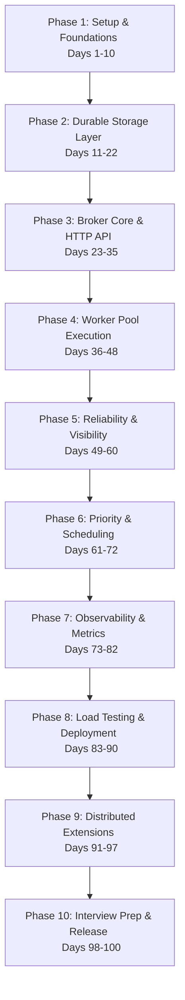

# Rustiq: 100-Day Production-Grade Build Plan

A comprehensive, day-by-day roadmap to design, implement, scale, and master a distributed task queue in Rust. This plan is designed to build system design depth, coding fluency under pressure, and production-level software engineering skills to stand out in SDE interviews at Google, Meta, Amazon, and Microsoft.

---

## 🗺 Roadmap Overview

---

## Phase 1: Project Foundations & Core Types (Days 1–10)
**Goal:** Build a solid understanding of system design concepts, initialize the project structure, define core data structures, and establish structured logging.

### Day 1: System Design Research & Architecture Mapping
*   **Action:** Read the Rustiq blueprint. Draw a high-level block diagram of the Producer, Broker, Storage Layer, and Worker Pool.
*   **Verification:** Save a sketch or text architecture diagram in your notes. Identify the boundaries of each module.

### Day 2: Advanced Async Rust Review
*   **Action:** Read Chapters 16 and 17 of *The Rust Programming Language* (concurrency and OOP traits) and research async runtimes (Tokio).
*   **Verification:** Explain to yourself how Tokio's work-stealing scheduler differs from green threads in Go.

### Day 3: Project Scaffold & Dependency Management
*   **Action:** Initialize the cargo project (`cargo init rustiq`) and configure `Cargo.toml` with: `tokio` (full), `axum`, `serde` + `serde_json`, `uuid` (v4), `chrono`, `sled`, `tracing` + `tracing-subscriber`.
*   **Verification:** Run `cargo check` to confirm all crates pull down and compile cleanly.

### Day 4: Core Domain Types (`types.rs`)
*   **Action:** Define the `Job` struct and `JobStatus` enum in a new file `src/types.rs`. Ensure they derive `Serialize`, `Deserialize`, `Debug`, `Clone`.
*   **Verification:** Add helper unit tests to `types.rs` that serialize a mock `Job` to JSON and back, checking for correctness.

### Day 5: Queue Configurations
*   **Action:** Add a `QueueConfig` struct to `src/types.rs` supporting variables like `visibility_timeout_secs`, `max_retries`, and `backoff_factor`.
*   **Verification:** Write a unit test validating default configuration fallbacks for arbitrary queue names.

### Day 6: Error Handling Architecture
*   **Action:** Define a custom, centralized `RustiqError` enum using `thiserror` (or vanilla `std::fmt`) covering storage, queue, API, and validation errors.
*   **Verification:** Write tests verifying that matching different errors extracts the correct debug information.

### Day 7: Storage Trait Abstraction (`storage/mod.rs`)
*   **Action:** Create `src/storage/mod.rs` and define the asynchronous `Storage` trait using the `#[async_trait]` attribute.
*   **Verification:** The trait should expose `async fn save_job`, `get_job`, `delete_job`, and `update_job_status`.

### Day 8: In-Memory Storage Mock
*   **Action:** Implement an in-memory storage mock using `HashMap` wrapped in a thread-safe `Arc<RwLock>` that implements the `Storage` trait.
*   **Verification:** Write unit tests to execute CRUD operations against the in-memory mock storage.

### Day 9: Logging Infrastructure Setup
*   **Action:** Configure the `tracing` subscriber in `src/main.rs` to output formatted, structured logs. Configure environment filter options.
*   **Verification:** Run the application and observe formatted log outputs containing file sources and timestamps.

### Day 10: Phase 1 Code Review & Cleanup
*   **Action:** Review imports, format files (`cargo fmt`), run `cargo clippy`, and resolve any compiler warnings.
*   **Verification:** Ensure no compiler warnings remain and the repository has a clean compilation state.

---

## Phase 2: Persistent Storage Layer (Days 11–22)
**Goal:** Implement a durable storage backend using `Sled` (a pure-Rust, embedded transactional database) with proper state guarantees.

### Day 11: Sled Mechanics & API Study
*   **Action:** Read the `sled` documentation. Focus on threads, concurrency guarantees (ACID), and key prefix scans.
*   **Verification:** Understand the difference between `sled::Db` and standard Relational Databases (like Postgres) in an embedded context.

### Day 12: Storage Backend Setup (`storage/sled.rs`)
*   **Action:** Create `src/storage/sled.rs`. Implement a database connection manager that initializes or opens a Sled database from a path.
*   **Verification:** Assert that a `.db` directory is created on disk when the application starts.

### Day 13: Sled Storage Impl: Write & Retrieve
*   **Action:** Implement `save_job` and `get_job` for the `SledStorage` struct. Store jobs as serialized JSON bytes under key format `job:<uuid>`.
*   **Verification:** Write a test that enqueues a job, shuts down the DB, re-opens the DB, and reads the identical job back.

### Day 14: Sled Storage Impl: Status Transitions & Deletes
*   **Action:** Implement status updates and job deletion in `SledStorage`.
*   **Verification:** Write a unit test validating that transitioning a job state from `Queued` to `Processing` is correctly written to Sled.

### Day 15: Sled Storage Impl: Queue Prefix Scans
*   **Action:** Implement a method in `SledStorage` to fetch all jobs belonging to a specific queue name using Sled's prefix scans.
*   **Verification:** Write a test storing 5 jobs across 2 different queues, scan each queue, and verify that correct counts are returned.

### Day 16: Thread-Safe DB Handles
*   **Action:** Ensure the `SledStorage` struct clone handles share references to the database handle safely across tokio tasks.
*   **Verification:** Verify Sled's internal thread pooling configuration matches the async execution model.

### Day 17: Storage Transaction Safeties
*   **Action:** Explore Sled transactions (`db.transaction()`) to perform atomic double-writes (e.g., writing the job and updating index states).
*   **Verification:** Write a test that fails midway through a simulated multi-step write to verify rollback behaviors.

### Day 18: Storage Failure Parsing
*   **Action:** Map Sled engine-specific errors to the custom `RustiqError` defined in Phase 1.
*   **Verification:** Assert that disk-full or lock errors return clean, readable system messages.

### Day 19: Storage Mock vs. Live Sled Tests
*   **Action:** Implement parameterized storage integration tests that can run against both the Mock memory and Sled database implementations.
*   **Verification:** Run `cargo test` and confirm identical behavioral outputs for both backends.

### Day 20: Database Directory Lifecycles
*   **Action:** Add setup and teardown helpers to unit tests to guarantee temp directories are deleted after tests complete.
*   **Verification:** Verify no orphan directories remain in `/tmp` or the target workspace after running test commands.

### Day 21: Database Corruptions & Recovery
*   **Action:** Implement validation checks during Sled initialization. If data deserialization fails due to file corruption, isolate the database or rebuild indexes.
*   **Verification:** Manually corrupt a test DB file, boot the app, and verify that recovery logic is triggered.

### Day 22: Phase 2 Code Review & Clippy
*   **Action:** Clean up storage files. Ensure documentation strings explain Sled index choices.
*   **Verification:** All tests must pass, and code coverage on the storage modules should be established.

---

## Phase 3: Broker Core & HTTP API Setup (Days 23–35)
**Goal:** Implement the Axum HTTP router, state sharing, request validation, and core queue management API.

### Day 23: Axum Framework Architecture
*   **Action:** Read the `axum` routing model documentation, focusing on Extractors, State injection, and response representation.
*   **Verification:** Sketch how HTTP requests map down to thread-safe state managers.

### Day 24: Axum Web Server Setup
*   **Action:** Create `src/api/mod.rs` and `src/api/handlers.rs`. Initialize the Axum router and boot the server in `src/main.rs`.
*   **Verification:** Launch the server and perform a `curl` query to check a dummy `/health` endpoint.

### Day 25: Shared App State
*   **Action:** Design an `AppState` struct holding `Arc<dyn Storage>` and queue states. Share this state with Axum using `Extension` or `State`.
*   **Verification:** Verify the router compiles with the shared state attached.

### Day 26: Request Payloads & Validation
*   **Action:** Implement `EnqueueRequest` input payload validation (e.g. queue name limits, payload formats).
*   **Verification:** Sending an invalid payload to the server should return a clear `400 Bad Request` with validation details.

### Day 27: Enqueue Endpoint (`POST /enqueue`)
*   **Action:** Implement the `POST /enqueue` endpoint. Generate the Job UUID, set statuses to `Queued`, save to Storage, and return 202.
*   **Verification:** Run a `curl -X POST` test enqueuing a job. Verify the response includes the new `job_id`.

### Day 28: Status Endpoint (`GET /status/:job_id`)
*   **Action:** Implement `GET /status/:job_id` looking up the job from the storage layer.
*   **Verification:** Verify that enqueuing a job and calling status on its ID returns the job's state matching your schema.

### Day 29: Queue Metadata Endpoint (`GET /queues`)
*   **Action:** Implement `GET /queues` returning active queue names, item counts, and job distribution.
*   **Verification:** Enqueue multiple jobs in different queues and request `/queues` to check that depths are reported correctly.

### Day 30: Cancellation Endpoint (`DELETE /jobs/:job_id`)
*   **Action:** Implement `DELETE /jobs/:job_id` to allow canceling jobs that are in the queue or delayed.
*   **Verification:** Delete a job, then query `/status/:job_id` to confirm its status is updated or the entry is removed.

### Day 31: HTTP Request Logging Middleware
*   **Action:** Add tracing middleware to Axum (`tower_http::trace::TraceLayer`) to log all incoming HTTP requests.
*   **Verification:** Confirm that client IP, paths, method, and latency are printed to stdout on every request.

### Day 32: Axum Router Integration Tests
*   **Action:** Write unit/integration tests using `tower::ServiceExt` to test route handlers directly without opening sockets.
*   **Verification:** Run tests validating status codes for enqueue, status, and cancel endpoints.

### Day 33: External Port Testing
*   **Action:** Spin up the application on a random port in tests, making actual HTTP requests using `reqwest`.
*   **Verification:** Integration tests should complete clean socket read-writes against localhost.

### Day 34: API Client Error Customizations
*   **Action:** Create custom JSON response handlers for 404, 400, and 500 error boundaries.
*   **Verification:** Ensure no stack traces or raw Rust panic logs escape to API client responses.

### Day 35: Phase 3 Verification & Performance Check
*   **Action:** Check clippy lints, format files, and run basic sanity tests.
*   **Verification:** Verify compile times and confirm memory footprints are stable under basic HTTP pings.

---

## Phase 4: Async Worker Pool & Job Execution (Days 36–48)
**Goal:** Build the async worker pool structure that spawns concurrent workers, registers handlers, and executes jobs safely.

### Day 36: Tokio Task Spawning Deep Dive
*   **Action:** Experiment with thread models and channels (`mpsc`, `broadcast`, `oneshot`) to prepare for worker orchestration.
*   **Verification:** Document lock semantics and channel characteristics you plan to use for coordinating workers.

### Day 37: The JobHandler Trait (`worker/mod.rs`)
*   **Action:** Create `src/worker/mod.rs`. Define the async `JobHandler` trait with a method signature: `async fn execute(&self, payload: Value) -> Result<Value, JobError>`.
*   **Verification:** Ensure it is marked with `#[async_trait]` and requires bounds `Send + Sync`.

### Day 38: WorkerPool Struct Design
*   **Action:** Create the `WorkerPool` struct representing worker instances, maximum concurrency parameters, and shared broker handles.
*   **Verification:** Define structural layouts and compile the file with placeholder references.

### Day 39: Job Handler Registry
*   **Action:** Add a registration map (`HashMap<String, Box<dyn JobHandler>>`) inside `WorkerPool` to match handlers to queue names.
*   **Verification:** Write a test demonstrating registration and retrieval of multiple mock handlers.

### Day 40: Worker Polling Loop
*   **Action:** Implement the loop that polls the broker for due jobs, fetches details, and assigns tasks.
*   **Verification:** Workers should loop continuously, pausing if no jobs are available.

### Day 41: Async Job Executor (`worker/executor.rs`)
*   **Action:** Create `src/worker/executor.rs` to handle executing a single job. Match the queue name to the registered handler and execute.
*   **Verification:** Verify the output matches the handler execution return value.

### Day 42: Panic Isolation
*   **Action:** Protect workers against panics within custom handlers using `tokio::task::spawn` and `futures::FutureExt::catch_unwind`.
*   **Verification:** Write a handler that panics explicitly. Verify that only the job execution task fails while the parent worker loop stays alive.

### Day 43: Sample Image Handler
*   **Action:** Write a demo `ImageResizeHandler` implementing the `JobHandler` trait to simulate standard work durations.
*   **Verification:** Verify execution runs asynchronously, logging operations correctly.

### Day 44: Concurrency Pool Verifications
*   **Action:** Write tests verifying that setting concurrency limits restricts the active running handlers count.
*   **Verification:** Set a pool limit of 2, spawn 5 slow jobs, and assert that only 2 jobs execute concurrently.

### Day 45: Graceful Worker Shutdown
*   **Action:** Implement pool shutdown using a broadcast channel to signal workers to stop polling and exit.
*   **Verification:** Trigger shutdown during worker execution, checking that the system waits for active executions to wrap up.

### Day 46: Backpressure Integration
*   **Action:** Pause broker polling if all workers in the pool are currently busy.
*   **Verification:** Assert that when concurrency is saturated, no jobs are extracted from the broker queue.

### Day 47: Integration: HTTP + Worker Pool
*   **Action:** Glue the components together. Start the Axum HTTP server and the `WorkerPool` side-by-side in `main.rs`.
*   **Verification:** Enqueue a job via curl and watch a registered worker pick up and complete the execution.

### Day 48: Phase 4 Review & Profiling
*   **Action:** Run clippy, formatting, and profile memory leaks during task allocations.
*   **Verification:** Ensure memory usage remains flat during sustained worker spin-ups.

---

## Phase 5: Reliability & Visibility Timeout (Days 49–60)
**Goal:** Implement the at-least-once delivery guarantee using SQS-like visibility timeouts, dead letter queues, and background reapers.

> [!IMPORTANT]
> **Visibility Timeout Design:** When a worker polls a job, the job is not deleted. Instead, its lease is updated (`lease_expires_at = now() + visibility_timeout`). If the worker crashes or does not ACK (Acknowledge) the job before expiration, a background reaper task makes it visible for processing again.

### Day 49: Exponential Backoff Math
*   **Action:** Write backoff calculations where delay increases exponentially ($2^{\text{retry\_count}}$ seconds) with jitter.
*   **Verification:** Write unit tests verifying delay increments under consecutive fail events.

### Day 50: Atomic Lease Assignment
*   **Action:** Implement atomic updates to transitions and lease timestamps when a worker acquires a job.
*   **Verification:** Write a test verifying that concurrent polling cannot lease the same job to two workers.

### Day 51: Job Acknowledgement (ACK)
*   **Action:** Implement the ACK API endpoint, removing successfully completed jobs from storage or marking them `Done`.
*   **Verification:** Acknowledge a running job and verify its record status becomes `Done`.

### Day 52: Job NACK (Negative ACK)
*   **Action:** Implement the NACK flow to release a failed job immediately, making it available for dispatch without waiting for lease timeouts.
*   **Verification:** Write a test verifying immediate retry dispatch of a NACK'd job.

### Day 53: Background Reaper Skeleton
*   **Action:** Implement a background loop in the Broker running every 5 seconds.
*   **Verification:** Verify that the loop prints status logs periodically without blocking other application tasks.

### Day 54: Expired Lease Scans
*   **Action:** Implement query logic scanning for jobs with status `Processing` where `lease_expires_at` has expired.
*   **Verification:** Store a mock job with an expired lease and check if the scanner identifies it correctly.

### Day 55: Requeuer Integration
*   **Action:** Implement requeue logic in the reaper, transitioning expired jobs back to `Queued` and clearing active leases.
*   **Verification:** Confirm that expired jobs reappear on the queue and are successfully re-dispatched to workers.

### Day 56: Dead Letter Queue (DLQ) Integration
*   **Action:** Route a job to `DeadLetter` status once its retry count exceeds `max_retries`.
*   **Verification:** Write a test verifying that a failing job moves to the DLQ after reaching its limit.

### Day 57: Crash Simulations
*   **Action:** Write a test that enqueues a job, starts a worker, and kills the worker task mid-execution.
*   **Verification:** Verify the reaper task detects the abandoned job and transitions it back to the queue.

### Day 58: Backoff Jitter Integration
*   **Action:** Incorporate randomized jitter into the backoff delay to prevent "thundering herd" issues.
*   **Verification:** Verify that retry delays for duplicate failure events are distributed randomly.

### Day 59: Scheduler Integration
*   **Action:** Ensure retrying jobs are stored with their scheduled retry times.
*   **Verification:** Write a test validating that retries are deferred to their correct scheduled times.

### Day 60: Phase 5 Integration Verification
*   **Action:** Run the complete test suite checking for deadlocks or race conditions between workers and the reaper task.
*   **Verification:** Verify that a pipeline execution completes successfully under synthetic worker failure scenarios.

---

## Phase 6: Priority Queueing & Scheduled Jobs (Days 61–72)
**Goal:** Implement heap-based priority sorting, delayed job scheduling, and recurring cron tasks.

### Day 61: Heap Priority Theory
*   **Action:** Study min-heap mechanics and Rust's `std::collections::BinaryHeap`.
*   **Verification:** Design a `PriorityJob` struct that implements `Ord` to support min-heap priority sorting.

### Day 62: PriorityJob Struct Implementation
*   **Action:** Implement the `PriorityJob` wrapper, using `priority` (low value = high priority) and enqueued time for tiebreaking.
*   **Verification:** Write tests verifying heap sorting order under various priority values.

### Day 63: Thread-Safe Priority Deque
*   **Action:** Integrate `BinaryHeap` into the broker wrapped in thread-safe locks (`Mutex`/`RwLock`).
*   **Verification:** Write a test that concurrently enqueues high and low-priority jobs and asserts they are dequeued in the correct order.

### Day 64: Starvation Prevention (Aging)
*   **Action:** Implement an aging algorithm that scans the priority heap periodically and boosts the priority of jobs that have been waiting.
*   **Verification:** Write a test verifying that low-priority jobs are eventually executed when higher-priority jobs are continually enqueued.

### Day 65: Scheduled Jobs Design
*   **Action:** Design delayed job storage by indexing jobs in Sled with `scheduled_at` timestamps.
*   **Verification:** Verify that a scan correctly filters jobs with scheduled timestamps in the past.

### Day 66: Background Scheduler Thread
*   **Action:** Implement a background scheduler loop that runs every 100 milliseconds.
*   **Verification:** Confirm the loop logs checks without affecting queue throughput.

### Day 67: Scheduled Job Dispatch
*   **Action:** Implement logic inside the scheduler loop that moves due jobs from the scheduled index into the active queue.
*   **Verification:** Enqueue a job with a 2-second delay. Verify it is not executed immediately, but runs after the delay.

### Day 68: Cron Expression Parsing
*   **Action:** Add the `cron` crate to parse cron-style expressions (e.g. `0 9 * * MON`).
*   **Verification:** Parse test strings and print calculated next execution times.

### Day 69: Recurring Jobs Engine
*   **Action:** Implement recurring execution: when a cron job completes, calculate the next run time and schedule it.
*   **Verification:** Run a cron task configured to run every second and verify multiple executions occur over time.

### Day 70: Priority Dispatch Tests
*   **Action:** Write automated integration tests asserting that priority ordering behaves correctly.
*   **Verification:** Check that a priority-0 job is dispatched before a priority-5 job.

### Day 71: Delayed Job Tests
*   **Action:** Write unit and integration tests confirming delayed jobs are executed at the correct times.
*   **Verification:** All tests must pass cleanly.

### Day 72: Lock Optimization
*   **Action:** Profile lock contention on the priority heap under heavy load.
*   **Verification:** Optimize critical sections to prevent worker threads from blocking other active tasks.

---

## Phase 7: Observability & Metrics (Days 73–82)
**Goal:** Instrument the broker and worker pool using Prometheus metrics and structured JSON logging.

### Day 73: Prometheus Integration
*   **Action:** Read the `prometheus` crate docs and set up the global registry structure.
*   **Verification:** Compile the application with the registry initialized.

### Day 74: Throughput & Count Metrics
*   **Action:** Implement Counters for job events: `jobs_enqueued_total`, `jobs_completed_total`, `jobs_failed_total`.
*   **Verification:** Write tests verifying counters increment when jobs are processed.

### Day 75: Gauge Metrics
*   **Action:** Implement Gauges to track real-time statistics: `queue_depth` and `workers_active`.
*   **Verification:** Verify gauges adjust up and down as queues change.

### Day 76: Latency Histograms
*   **Action:** Instrument histograms to track processing duration and queue wait times.
*   **Verification:** Verify histograms record values in milliseconds.

### Day 77: Metrics Endpoint Routing
*   **Action:** Add a `/metrics` route in Axum to expose Prometheus metrics.
*   **Verification:** Verify `curl localhost:3000/metrics` returns standard Prometheus formatted output.

### Day 78: Structured Logging with Tracing
*   **Action:** Set up `tracing-subscriber` to format log lines as JSON.
*   **Verification:** Confirm stdout outputs JSON logs containing fields like `job_id` and `queue`.

### Day 79: Distributed Trace Contexts
*   **Action:** Propagated trace contexts through Tokio tasks to trace jobs from HTTP ingestion to worker completion.
*   **Verification:** Verify that log lines for a specific job share the same request correlation ID.

### Day 80: System Resource Metrics
*   **Action:** Expose process memory usage and storage write latencies as metrics.
*   **Verification:** Confirm that `/metrics` includes these system metrics.

### Day 81: Metrics Integrity Tests
*   **Action:** Write tests that make requests to the API and parse the `/metrics` endpoint output to verify accuracy.
*   **Verification:** Tests must confirm metrics increment as expected.

### Day 82: Phase 7 Code Review
*   **Action:** Clean up instrumentation code and optimize the performance of metric writes.
*   **Verification:** Clippy and formatting checks must pass.

---

## Phase 8: Load Testing, Deployment, & CI/CD (Days 83–90)
**Goal:** Write load tests, optimize performance to exceed 10,000 jobs/sec, dockerize the environment, and establish automated pipelines.

### Day 83: Load Testing Script (`tests/load_test.rs`)
*   **Action:** Build a performance testing harness using Tokio and reqwest to saturate the broker.
*   **Verification:** Run the harness and measure raw throughput.

### Day 84: Performance Bottleneck Analysis
*   **Action:** Run load tests and analyze system bottlenecks (e.g. storage write locks, serialization cost).
*   **Verification:** Identify the primary factors limiting performance.

### Day 85: 10,000 Jobs/Second Optimization
*   **Action:** Optimize Sled writes (using batching or async flushes) and reduce lock scope in the queue.
*   **Verification:** Reach the target benchmark of 10,000 enqueues/sec.

### Day 86: Containerization (Dockerfile)
*   **Action:** Create a multi-stage `Dockerfile` to build a minimal release image.
*   **Verification:** Build the image and confirm its size is minimal (< 30MB).

### Day 87: Docker Compose Setup (`docker-compose.yml`)
*   **Action:** Create a `docker-compose.yml` file configuring the Broker, Prometheus, and Grafana.
*   **Verification:** Run `docker-compose up` and verify all services start and communicate.

### Day 88: Grafana Dashboard Construction
*   **Action:** Build a Grafana dashboard visualising queue depth, throughput, P99 latency, and DLQ rates.
*   **Verification:** Verify metrics update in real-time as the load-testing tool runs.

### Day 99: CI Pipeline Configuration
*   **Action:** Write a GitHub Actions workflow `.github/workflows/ci.yml` to run tests and lints on push.
*   **Verification:** Push to GitHub and confirm the workflow completes successfully.

### Day 90: Deployment Dry-run
*   **Action:** Deploy the system to a clean sandbox environment using Docker.
*   **Verification:** Verify the system operates correctly from initial boot to shutdown.

---

## Phase 9: Horizontal Scaling & Advanced Extensions (Days 91–97)
**Goal:** Implement horizontal scaling with a Redis cluster backend, gRPC APIs, and idempotency guarantees.

### Day 91: Distributed Storage Design
*   **Action:** Study redis cluster architectures and how to transition from local embedded storage to shared storage.
*   **Verification:** Document the data structures and Redis commands required.

### Day 92: Redis Storage Engine
*   **Action:** Implement a `RedisStorage` backend using the `redis-rs` crate, conforming to your `Storage` trait.
*   **Verification:** Write unit tests showing CRUD operations against a local Redis instance.

### Day 93: Redis Pub/Sub Worker Notifications
*   **Action:** Replace polling with Redis Pub/Sub to trigger workers as soon as a job is enqueued.
*   **Verification:** Verify worker latency drops when jobs are enqueued on empty queues.

### Day 94: gRPC Interface Design
*   **Action:** Design a protocol buffer definition for the broker API, detailing service definitions and messages.
*   **Verification:** Compile the `.proto` schema file using `tonic-build`.

### Day 95: gRPC Server Implementation
*   **Action:** Implement the gRPC server using `tonic`. Support high-throughput enqueues.
*   **Verification:** Run the server and call its methods using a command-line client like `grpcurl`.

### Day 96: Exactly-Once Delivery (Idempotency)
*   **Action:** Implement idempotency key storage and transaction checks to ensure duplicate enqueues are ignored.
*   **Verification:** Write a test that enqueues the same payload with the same key and verifies only one job is created.

### Day 97: Job Chaining (DAG Workflows)
*   **Action:** Implement basic job chaining where a job starts only after a list of parent job IDs complete.
*   **Verification:** Enqueue a chained sequence and verify they run in order.

---

## Phase 10: Interview Whiteboarding, Demos, & Release (Days 98–100)
**Goal:** Document the system architecture, prepare system design answers, and publish the open-source repository.

### Day 98: System Design Interview Blueprinting
*   **Action:** Prepare interview notes comparing Rustiq to Celery, BullMQ, and Kafka. Answer questions like "how does this scale to 1 million jobs/sec?".
*   **Verification:** Review and practice presenting the system architecture diagram.

### Day 99: Documentation & Demo Assets
*   **Action:** Write the README, including system diagrams, benchmark metrics, and a quick-start guide.
*   **Verification:** Review the README and confirm it presents the project professionally.

### Day 100: Launch & Open Source Release
*   **Action:** Publish the repository on GitHub and write a technical blog post detailing the build journey and performance metrics.
*   **Verification:** Confirm all project files are checked in and CI is passing.

---

> [!TIP]
> **Suggested Study Schedule:** Spend 2 hours coding and 30 minutes reading the recommended books (*Designing Data-Intensive Applications* is highly recommended for Phase 5 & 9).
