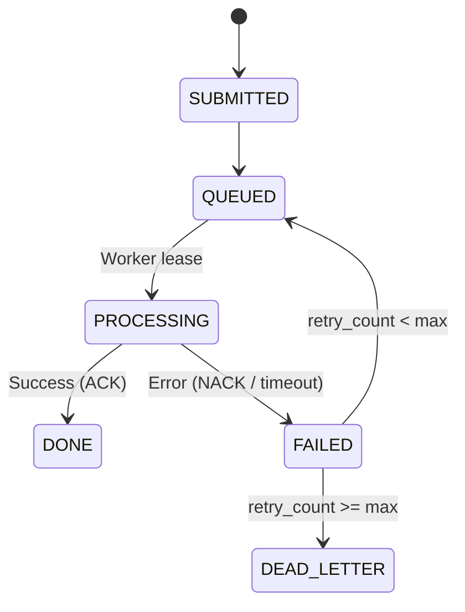
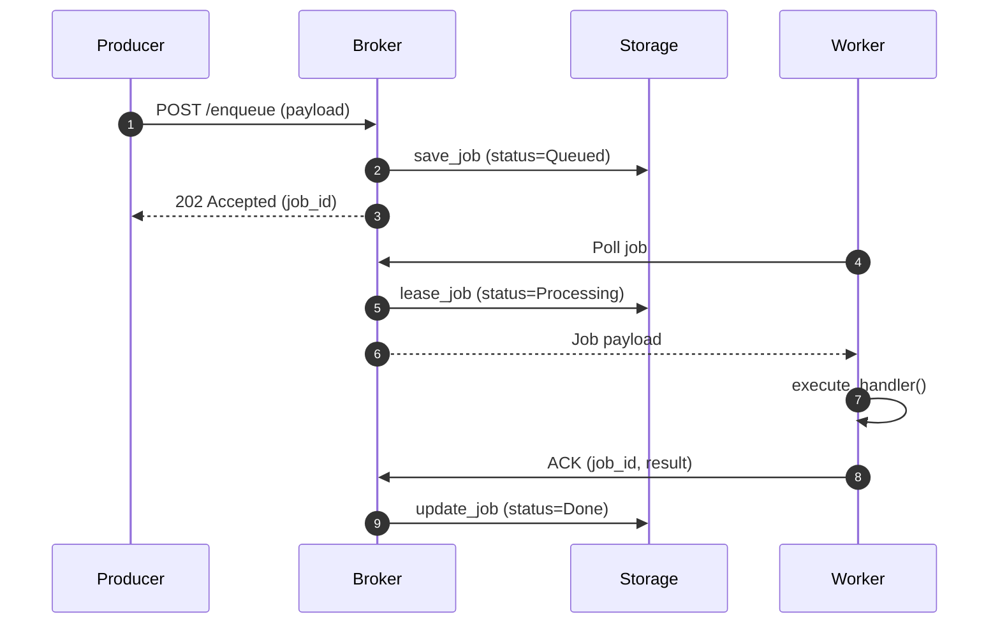

# Rustiq System Architecture Blueprint

This document describes the high-level architecture, component boundaries, lifecycles, and data flows of Rustiq—a production-grade distributed task queue built in Rust.

## 1. Component Boundaries

The system is composed of four decoupled layers communicating via defined protocol boundaries:
- **Producer Client**
- **Broker / Server**
- **Storage Layer**
- **Worker Pool**

### 1.1 Producer Client
- **Role:** Generates tasks, serializes payloads, assigns unique identifiers (UUIDs), and dispatches requests to the Broker.
- **Communication Protocol:** HTTP REST API (using JSON) or high-performance TCP.
- **Crates/Tools:** `serde` (serialization), `uuid` (unique IDs), `reqwest` (HTTP requests).

### 1.2 Broker / Server
- **Role:** Acts as the central coordinator. Receives jobs from Producers, manages queue state, schedules delayed tasks, and dispatches jobs to Workers.
- **Crates/Tools:** `tokio` (async runtime), `axum` (web framework).

### 1.3 Storage Layer
- **Role:** Guarantees durability of jobs, records state changes, logs execution results, and manages dead-letter assignments.
- **Crates/Tools:** `sled` (embedded key-value DB), `redis` (clustered memory storage).

### 1.4 Worker Pool
- **Role:** Multi-threaded execution environment. Pulls jobs from the Broker, routes tasks to handlers, manages panics, and reports success or failures.
- **Crates/Tools:** `tokio` (concurrency tasks), `async-trait`.

## 2. Job Lifecycle & State Machine

Every task flows through a strict state machine to prevent loss and guarantee at-least-once delivery:
- **SUBMITTED:** The task has been received by the broker API.
- **QUEUED:** The task is positioned in the priority queue, waiting to be leased.
- **PROCESSING:** A worker has leased the job for execution.
- **DONE:** Execution succeeded; results are saved.
- **FAILED:** Execution failed, retry counter incremented.
- **DEAD_LETTER:** Max retries exceeded; isolated for analysis.

### 2.1 State Transition Flow

## 3. Core Data Flow & Protocols

The sequence of interactions during task ingestion and worker dispatch:
1. **Enqueue Flow:** Producer sends a job payload to the Broker HTTP API. The Broker persists the job in Storage and replies with a `202 Accepted` status.
2. **Dispatch Flow:** Workers send poll requests to the Broker. The Broker leases a job, updates its lease timestamp, and returns it to the worker.

### 3.1 Sequence Diagram

